# Projecting Food Insecurity Rates in the US by County

### Flatiron School Data Science Capstone Project<br>By Khyatee Desai<br>Jan. 6, 2021

# Overview
Food insecurity (FI) is defined as the inability to consistently and reliably obtain enough food, due to a lack of resources. Food insecurity rates are one of the primary metrics used in determining how resources get distributed to communities through government assistance programs such as the Supplemental Nutrition Assistance Program (SNAP,) through non-profits organizations such as Feeding America, and through mutual-aid projects. <br><br>
These organizations tend to prioritize resource allocation in the form of food, money, and financial relief to communities that demonstrate the greatest need in a *quantifiable* way. The goal of this project is to predict future food insecurity rates at the county level to aid in resource allocation and to better direct preventative measures to those areas *before* the issue gets worse.

# Business Problem

Food insecurity, is not a phenomena that can be easily predicted, or even measure in real-time for two reasons: first, it is dependent upon a number of interwoven factors that can grow and change in unpredictable ways. Second, FI rate is a measure that is often determined retroactively, based on how food-assistance programs end up being utilized, and how survey respondents end up reporting their past food-related needs.<br><br>
Currently, food insecurity rates for the past year are determined through the Current Population Survey (CPS,) which is a nationally representative survey conducted by the Census Bureau for the Bureau of Labor Statistics. In December of each year, 50,000 households respond to this survey, answering questions related to income, food spending, and the use of government and community food assistance programs, all of which are factored together to produce an annual food insecurity rate estimation.<br><br>
While this annual survey provides incredibly valuable insight into the past needs of people at the community level, it does not inherently have the predictive capability to determine which communities will face the greatest impacts from food insecurity in the future, especially in the face of a worldwide pandemic that drastically impacts employment status, businesses, houselessness, and mobility.<br><br>
**Therefore, the goal of this capstone project is to aid in a proactive solution to food insecurity, by using regression models to project current FI rates using closely linked indicators such as houselessness, food cost, race, and employment status.**

# Data
The datasets used for the MVP model come from six different sources and are each broken down into yearly datasets spanning the years 2009-2020:

| DATASET        |   SOURCE        | DESCRIPTION                                                                                                                                                                                                                                                                                                                                                                                                                                                                                                                                                               |
|-------------|----------------------|--------------------------------------------------------------------------------------------------------------------------------------------------------------------------------------------------------------------------------------------------------------------------------------------------------------------------------------------------------------------------------------------------------------------------------------------------------------------------------------------------------------------------------------------------------------------------------|
| Food insecurity data    | Feeding America [Map the Meal Gap Study](https://www.feedingamerica.org/research/map-the-meal-gap/how-we-got-the-map-data)     | This dataset contains data on food insecurity rates in the US by county, from 2009-2018.                                                                                                                                                                                                                                                                                                                                                                                                                                                                                                                |
| Unemployment Data              | [Bureau of Labor Statistics](https://www.bls.gov/lau/#tables)        | This dataset contains yearly data on the Labor Force of each US county, for the years 2009-2020. The files include data on total workforce, and unemployment rates.                                                                                                                                                                                                                                                                                                                                                                                        |
| Demographic Data             | United States Census Bureau [County Population Estimates](https://www.census.gov/data/tables/time-series/demo/popest/2010s-counties-detail.html)        | This dataset contains columns on demographic information such as gender, race, and age, for each US county, for years 2010-2019.                                                                                                                                                                                                                                                                                                                                                                                                           |
| Houselessness Data   | US Dept. Housing & Urban Development (HUD) [Point in Time Estimates](https://www.hud.gov/2019-point-in-time-estimates-of-homelessness-in-US)      | This dataset contains data on houselessness rates in the US by Continuum of Care (CoC,) for the years 2009-2019.                                                                                                                                                                                                                                                                                                                                                                                                  |
| Rent Prices     | [Zillow Observed Rent Index](https://www.zillow.com/research/data/)      | This dataset contains _monthly_ data from Zillow.com on 1-bedroom rent prices _by zipcode_, for the years 2014-2020. The data is produced using the **Zillow Observed Rent Index** (ZORI,) which is a smoothed measure of the typical observed market rate rent across a given region.                                                                                                                                                                                                                                                                                                                                                                                      |
| Food Business Data           | US Census Bureau [County Business Patterns](https://www.census.gov/programs-surveys/cbp/data/datasets.html)      | This dataset contains data on all businesses in the US at the County level, for years 2009-2018. The dataset is used below to get Food Retail data, which includes grocery stores, wholesalers, and restaurants.                                                                                                                     |
|Current Population Survey| US Census Bureau [CPS Datasets](https://www.census.gov/programs-surveys/cps/data/datasets.html) |The CPS and Basic Monthly CPS surveys provide information on households such as median income, household size, disability status, and healthcare coverage.
                               
# Preprocessing
There are 55 datasets used to produce features for the MVP model, each of which must undergo intensive pre-processing before EDA and modeling can occur.
-  import each dataset, which contains a folder of CSV files for each year, and standardize any differences between the years
- preliminary cleaning, such as renaming columns for interpretability and dropping features not needed for EDA or modeling, such as unique ID numbers or metrics that are irrelevant to this project.
- map coded columns to their corresponding columns using data dictionaries
- reformat GEOID's (also called FIPS codes) for each observation at the County level - FIPS code will be used as the primary/foreign key for each dataset to be joined together.
- impute missing values in the Feeding America dataset for years 2011-2013 by using averaged change between 2010 and 2014 data.
- replace special characters such as "--" with null
- add a "Year" column to each yearly dataset, and then vertically concatenate all the yearly datasets together
- horizontally concatenate all 6 dataframes into a main dataset for all years and all features

**The following images depict the 2009 Businesses dataset before and after data cleaning.**<br><br>
**Before cleaning:**
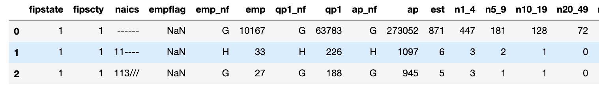<br><br>
**After cleaning:**


### Data Dictionary
This table describes each of the main features of the final cleaned dataset  (before feature engineering) which is used for EDA and modeling:
| FEATURE  |      DESCRIPTION       |   DATA TYPE                                                                                                                                                                                                                                                                                                                                                                                                                                                                                                                                                          |
|----------|---------------------|-------------------------------------------------------------------------------------------------------------------------------------------------------------------------------------------------------------------------------------------------------------------------------------------------------------------------------------------------------------------------------------------------------------------------------------------------------------------------------------------------------------------------------|
| FIPS | County level identification code (also referred to as GEOID|str|
|Rent | Average 1-Br Rent price | float|
|Year | Year data was collected | str
|coc_number | Continuum of Care (CoC) number - corresponds to houselessness data | str
|Houseless_rate | Percent of population within the county that is houseless | float
|Sheltered_rate | Percent of the population of a county that is houseless and resides in a shelter | float
|Unsheltered_rate | Percent of the population of a county that is houseless and does not reside in a shelter |float
|State | US State name | str
|County| County name | str
|TOT_POP | Population count within a county | float
|TOT_MALE | Count of all males| float
|TOT_FEMALE |Count of all females | float
|TOT_WHITE | Count of all white people within a county |float
|TOT_BLACK| count of all Black people within a county|float
|TOT_NATIVE| count of all Indigenous people within a county| float
|TOT_ASIAN| count of all Asian people within a county|float
|TOT_PACIFIC|count of all Pacific Islander people within a county|float
|TOT_LATINX| count of all LatinX people within a county|float
|State/County| State/County combination| str
|FI Rate| Percent of population within a county that is food insecure (target variable) | float
|Low Threshold Type| Low threshold food assistance programs by State| str
|High Threshold Type| High threshold food assistance programs by State| str
|Cost Per Meal| Average cost per meal| float
|Num_wholesale| Number of wholesale business within a county|float
|Num_restaraunts| Number of restaurants and cafes within a county| float
|Num_grocery | Number of grocery stores and markets within a county|float
|Total_workforce| Total number of people within a county who are able to legally work| float
|Employed | Total number of people within a county who are employed|float
|Unemployed| Total number of people within a county who are unemployed | float
|Unemployment_rate |Percent of the total workforce within a county that is unemployed|float|                                                                                                         |
|hh_med_income|Household median income | float
|pop_disabled|Number of respondents who are disabled|float|
|pop_hs_grad|Number of respondents who graduated highschool|float|
|pop_bachelors|Number of respondents with a bachelors degree|float|
|pop_grad_degree|Number of respondents with a graduate degree|float|
|pop_disabled|Number of respondents who are disabled|float|
|pop_disabled|Number of respondents who are disabled|float|
<br>

For a detailed walkthrough of the cleaning process used to derive this cleaned dataset, please view data cleaning notebooks [part one](notebooks/cleaning_pt1.ipynb) and [part two](notebooks/cleaning_pt2.ipynb).

# Exploratory Data Analysis
This project focuses on projecting future FI rates, at the county level. This means that both **time** and **geography** are important components of understanding the data. The [EDA notebook](notebooks/EDA.ipynb) addresses 3 questions to help gain a better understanding of food insecurity, and how it relates to time, geography, and its closely linked indicators.<br>

## Question 1. How have metrics such as unemployment, houselessness, and food insecurity rates changed over time?
The first EDA question explores how different features from the original dataset have changed over time. Because this project ultimately aims to project food insecurity rates for 2020, it is important to get an understanding of how features change *over time*, and whether they follow any discernible trends.<br>

Each feature group is scaled to the same magnitude, and visualized using lineplots or/and barcharts. The construction of these multi-variable charts is accomplished using two functions: [`lineplot()`](src/functions.py) and [`barchart()`](src/functions.py), both of which can be found in the src folder of this repository.
### Food Insecurity, Houselessness, and Unemployment Rates, by Year
The charts below aim to visualize and compare the trends between these three scaled features over time:

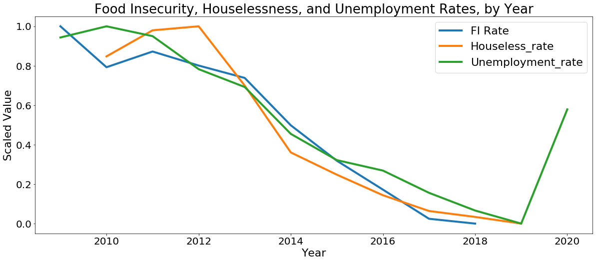

The lineplots above indicate there is a strong visible correlation between FI rate (target variable,) unemployment, and houseless rates. This is important to keep in mind, moving into modeling and inspecting feature importance. Although the data is not available for the MVP, the strong relationship between these three features is also a strong indicator that FI rates and houselessness will drastically increase in 2020, alongside unemployment rate.

### Food Insecurity in Different Communities, by Year
The following lineplots aim to look at how average food insecurity rates differ across different racial communities over time:

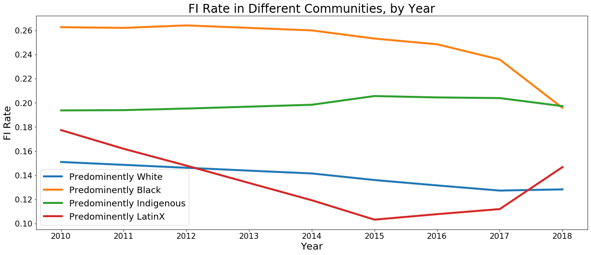

The above lineplots indicate that average FI rates are highest in Black communities, followed by Indigenous and LatinX. While the general trend is downwards, some communities encounter anomalous movement, such as predominantly LatinX communities, which face an upward spike in FI Rates moving into 2018. It is important to note that these rates are not directly tied to racial groups, but rather counties with different predominant racial demographics.

### Average Unemployment Rates in Different Communities, by Year
The following plots inspect average unemployment rates in different racial communities, by year.

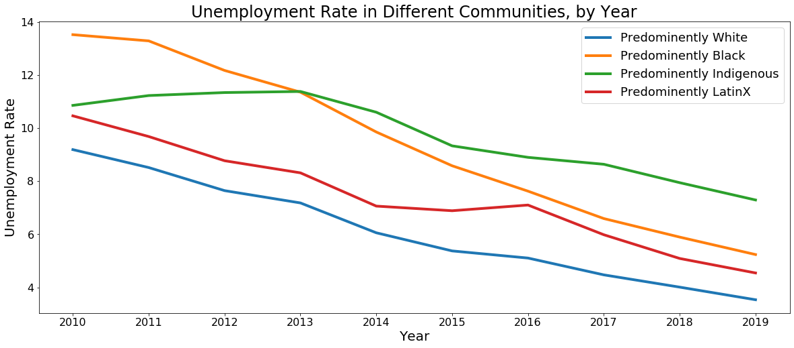

The above lineplots indicate that predominantly Black and Indigenous communities face higher average rates of unemployment, followed by LatinX communities. The general trend of average unemployment rate is downwards over time.


## Question 2. How do unemployment, race, and food insecurity rates vary geographically?
The purpose of exploring this question is to gain a better understanding of the geographic component of food insecurity and related features.
<br>
This question was explored by producing several chroropleth maps, which are heatmaps that visualize a particular feature across a geographic area. The maps are generated using a function called [`choropleth()`](src/functions.py) which takes a dataframe, feature, year, color palette, and title, and generates a choropleth map.

### Unemployment Rate, by County, 2019 and 2020

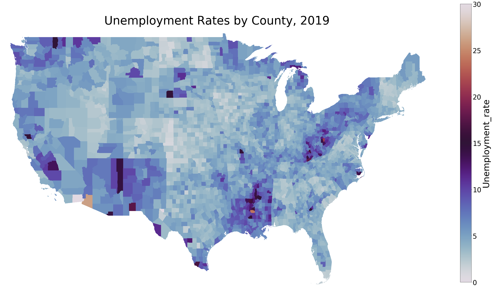
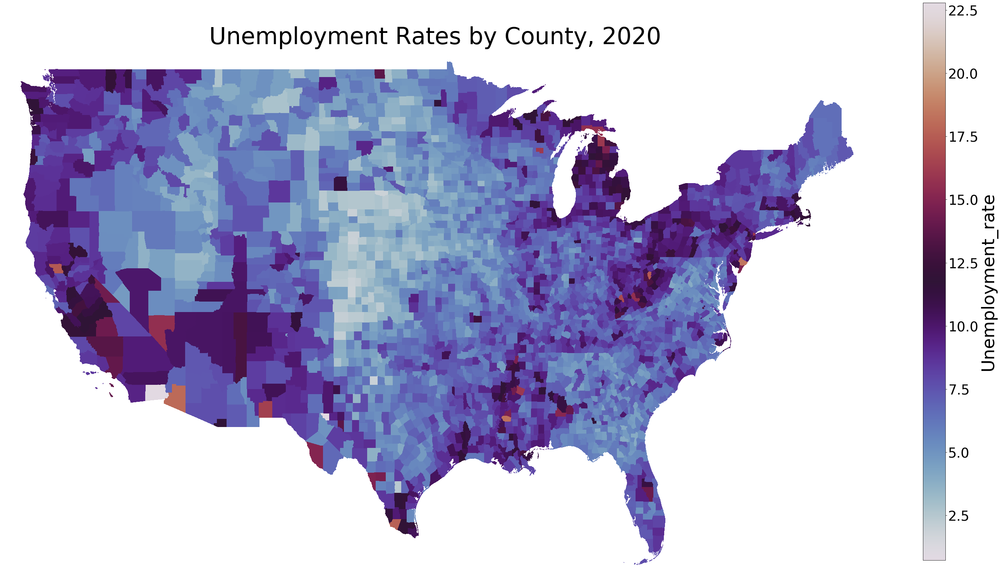

Unemployment rates were at a record low in 2019 before the pandemic started, and shot up significantly in 2020, as can be seen by the maps above, which show a large increase in unemployment rates across the country, and especially on the coasts. 

### PoC Population Percentage by County, 2010 and 2020
These maps help to visualize the areas of the United States whose populations are predominantly non-white.


The above maps indicate that while the majority of US counties are predominantly white, there are significant areas, such as much of the southern states and portions of the Southwest that are predominantly communities of Color. There does not seem to be a significant change in this demographic spread between 2010 and 2018.

### Food Insecurity Rates by County, 2009 and 2018
The following maps visualize FI Rates by county in 2009 and 2018.

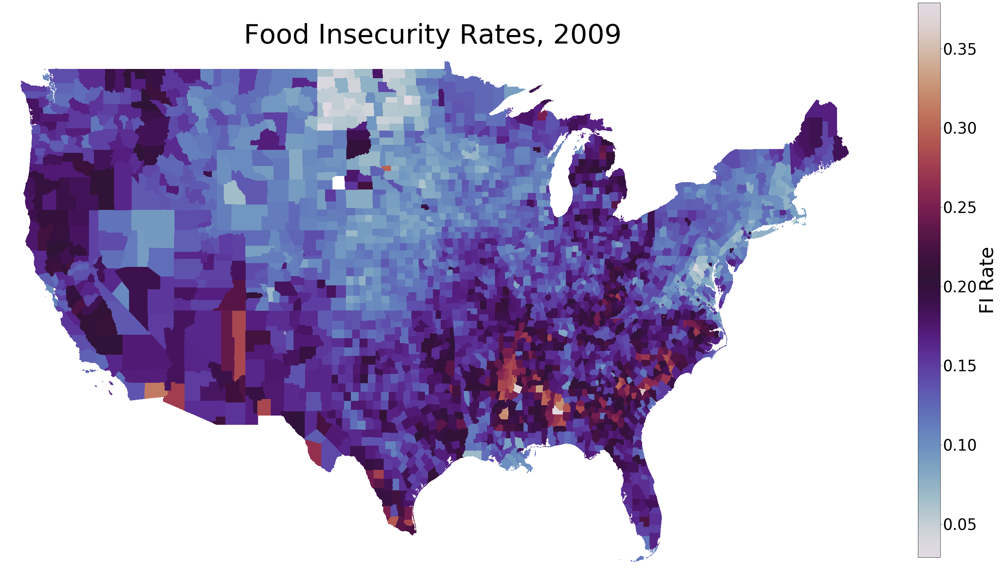
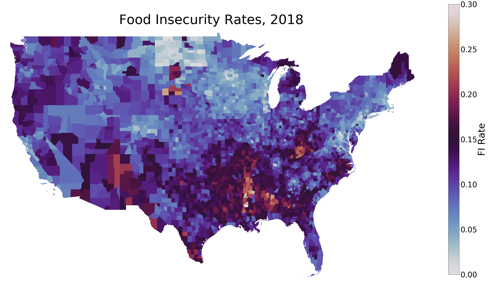

The maps above indicate lower average food insecurity rates over time in some areas, such as the Pacific Northwest, and significantly higher rates in Southern counties. This is important to note, given that **while national averages for FI rates have gone down over time, these maps indicate that in some communities, this problem has actually been exacerbated over time.<br><br>
When compared to the maps above which visualize communities of color, it is easy to see that the counties which are most severely effected by food insecurity very closely parallel the areas of the country that are predominantly non-white.**

## Question 3. What is the relationship between food insecurity rate and other factors such as rent prices, unemployment, houselessness, and race?
The purpose of this final EDA question is to determine how the other features in the dataset, such as average rent prices and houselessness rates, directly relate to food insecurity rates. These observations will be important to keep in mind moving into the modeling process and looking at coefficients/feature importances.

### FI Rate Distribution, by Rent Prices
The below histograms show the distribution of FI rates in areas with 1-br apartment rent prices above $2000, vs areas with rent prices below $1000.

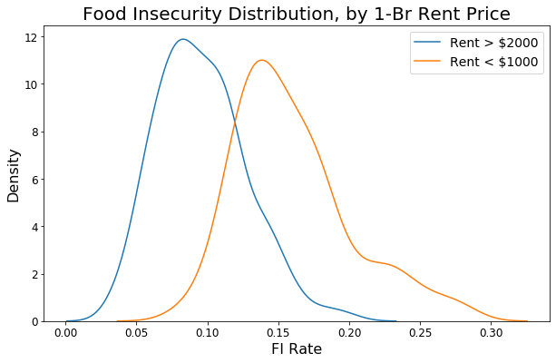

The above histograms indicate a visually significant difference between the two. Areas with lower rent prices have generally higher FI Rates with a mean around 0.14, while areas with higher rent prices have lower FI Rates with a mean around 0.08. This makes sense, given that "wealthier" areas likely less from food insecurity.

### FI Rate Distributions, by Unemployment Rate
The following histograms plot FI rate distribution, by areas with unemployment rates above %15, vs areas with unemployment rates below %5.

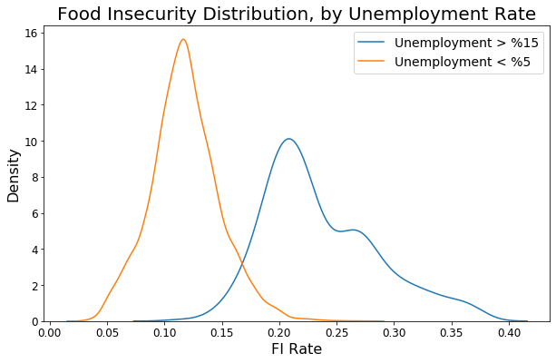

The above histograms show a visually significant difference in FI rates between areas based on unemployment rates. Areas with high unemployment rates have higher average FI Rates with a mean around 0.23, while areas with low unemployment rates have lower average FI rates averaging around 0.11. This is pretty intuitive, given that being unemployed is a likely cause of being unable to afford food.

### FI Rate Distribution, by Houseless Rates
The below histograms plot food insecurity distributions of areas with a houseless rate above %1, and areas with a houseless rate below %0.01.

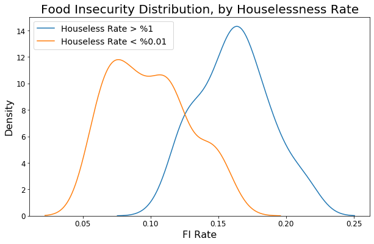

The above histograms indicate a visually significant difference between the two distributions. Areas with higher houselessness rates have a higher average FI Rate of around 0.16, versus areas with low houselessness averaging around 0.08. This makes sense, given that being houseless possibly indicates a lack of money, which lacks to an inability to buy enough food.

### FI Rate Distribution, by Race
The following histograms plot food insecurity rate distributions for areas of predominantly different races.

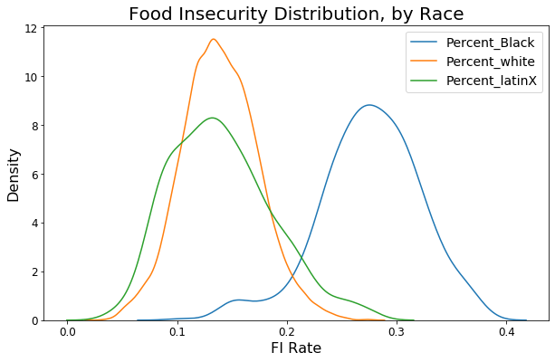

The above histograms indicate a visually significant different in FI rates for different racial communities. Areas that are predominantly Black are shown to have a much higher average FI rate of 0.29, versus predominantly white or LatinX communities with averages around 0.14. This is important to keep in mind, when considering feature importance and factors that are significant indicators for food insecurity.

## Data Analysis Summary
This data analysis explores the above questions through the lens of time and geography.
From the analysis, we see close relationships between FI Rates, unemployment rates, houseless rates, and race, both in terms of which areas are **geographically** impacted most, as well as how these different features have changed **over time**.<br>
<br>Communities of color, particularly Black communities, as well as communities with high unemployment and houselessness are shown through this analysis to have the highest FI rates. In addition, while many features such as FI rate, unemployment, and houselessness have decreased over time *on average*, the above choropleth maps indicate that these factors have actually been *exacerbated* in certain geographic areas over time.<br><br>
**The findings of this data exploration are meaningful when determining which communities and geographic areas are most at-risk for high food insecurity rates, and should be used both in terms of allocating resources to these communities, as well as taking proactive measures to address the root cause of these issues that disproportionately affect certain communities over others.**

# Feature Engineering
Before beginning modeling, several new features are derived from the original dataset features in the [feature_engineering.ipynb](notebooks/feature_engineering.ipynb) notebook. These engineered features are saved using Pickle, and imported into the modeling notebook later on. 
### Demographics Percentage Breakdowns
Demographic percentages make it possible to compare the demographic distribution of different counties, while accounting for population density differences.<br>
Ex. `df['Percent_male'] = df['TOT_MALE']/df['TOT_POP']`

### Interaction Features
An interaction feature is created for each combination of continuous features, and the "best" performing features are added to the main dataframe, by running them in a simple OLS model and comparing R2 values. Interaction Features are derived using the following calculation:<br>
`df[feature1+'_X_'+feature2] = df[feature1] * df[feature2]`<br>
Interactions help to account for coexisting features - for example, someone of identity A ***and*** identity B may have a much greater chance of being food insecure than someone of only identity A ***or*** identity B

### Log Transformations
Log features are created by taking the natural log of a feature, and adding this new feature to the dataframe. Log transformations can be useful to better model the shape of data that has very high outliers, by penalizing high values more than smaller ones.<br>

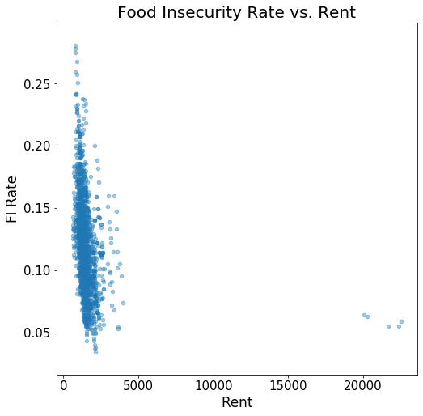
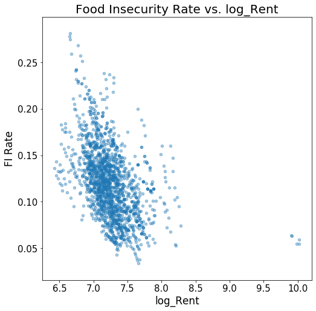

The above images show scatter plots of Rent price vs. FI Rate, and **Log** Rent price vs. FI Rate. The log transformation penalizes the outliers present within the rent data, allowing the shape of the data to be better interpreted.

### Dummy Variables
Dummy variables are created for the categorical variables High and Low threshold, by using the Pandas `get_dummies()` function to turn them into 1's and 0's.

# Feature Selection and Modeling 
The modeling process uses final cleaned data with engineered features, produced and pickled from [feature_engineering.ipynb](notebooks/feature_engineering.ipynb). Each model produced for the MVP is a simple linear regression, using different features determined through a variety of feature selection techniques.<br>


## Model 1: All Features
The first model uses all features in the cleaned dataset, as well as all engineered features.
|            | R2     |    RMSE                                                                                                                                                                                                                                                                                                                                                                                                                                                                                                                                                            |
|-----|-----|-------|
| Train | 0.652 | 0.0258|
| Test | 0.638 | 0.0260 |

Model 1 had a cross validation R2 score of  **0.587**, with 5 folds. 

## Model 2: Remove Outliers
The [EDA notebook](notebooks/EDA.ipynb) includes a section on inspecting which features have the largest outliers, using box and whisker plots. The following plot focuses on the features with highest outliers: 'TOT_POP', 'TOT_MALE', 'TOT_FEMALE', 'TOT_BLACK', 'TOT_ASIAN','TOT_WHITE', 'TOT_LATINX','Total_workforce', and 'Employed'

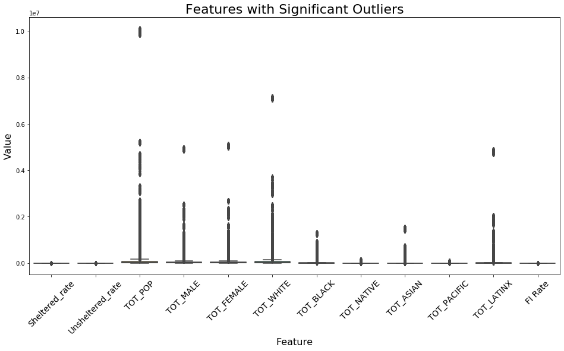

For model 2, each feature with visibly high outliers is iterated on, and if the feature has observations _greater_ than +/- 2 standard deviations of the mean, it reduces outliers to +/- 2 standard deviations from the mean of that feature.<br>
The model is then re-run using the same process as model 1, now on data with reduced outliers:


|            | R2     |    RMSE                                                                                                                                                                                                                                                                                                                                                                                                                                                                                                                                                            |
|-----|-----|-------|
| Train | 0.760 | 0.0214|
| Test | 0.757 | 0.0215 |

Model 2 had slightly better R2 scores, but lower RMSE, and more importantly, a lower cross validation R2 score of  **0.503**, with 5 folds. 


## Model 3: Remove Multicollinear Features
Multicollinearity occurs when features in the dataset are correlated to one another, rather than only to the target variable. Multicollinearity can create noise within the data, and is therefore important to address during the feature selection process. 
A heatmap is produced from correlation matrix in the [EDA notebook](notebooks/EDA.ipynb), which highlights that houseless rate, sheltered/unsheltered rates, and all of the race-related features are highly correlated with one another.
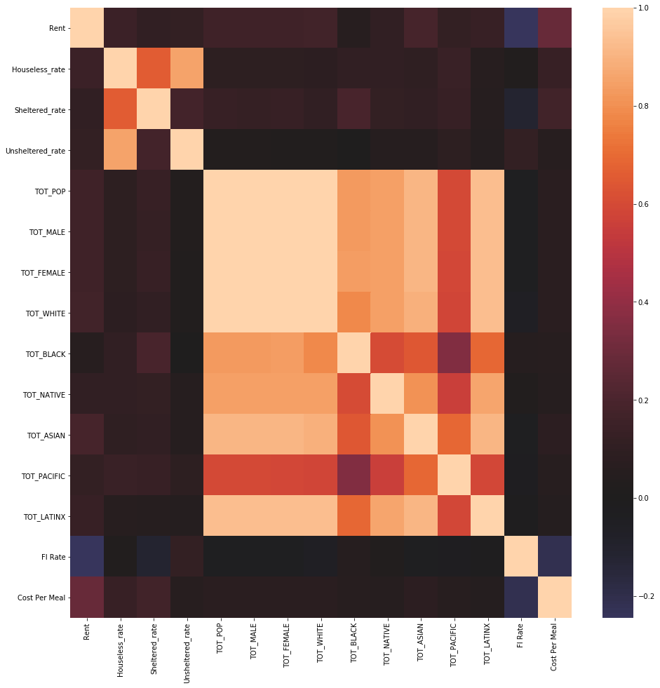

For model 3, Variance inflation factor (VIF) is used to remove highly correlated features. VIF helps quantify the severity of multicollinearity in a dataset by comparing variance of the model using different terms. High VIF scores indicate severe multicollinearity, so model 3 uses only features with VIF scores below 10. 

|            | R2     |    RMSE                                                                                                                                                                                                                                                                                                                                                                                                                                                                                                                                                            |
|-----|-----|-------|
| Train | 0.450 | 0.032|
| Test | 0.473 | 0.0318 |

Model 3 had a cross validation R2 score of  **0.385**, and the worst scores for both R2 and RMSE.

## Model 4: K-Best Features
Model 4 uses `SelectKBest()` to determine the best k features to use in a model. A variety of k values are looped through to determine the k that yields the best performing model. The best k value is determined to be 93, so model 4 is run with those features. 

|            | R2     |    RMSE                                                                                                                                                                                                                                                                                                                                                                                                                                                                                                                                                            |
|-----|-----|-------|
| Train | 0.791 | 0.0199|
| Test | 0.791 | 0.0200 |

Model 4 performs significantly better than others, with an average **R-squared value of .791**, an **RMSE of .0199**, and an average **cross validation score of 0.743.**

## Model 5: Recursive Feature Elimination
Recursive feature elimination is used to iteratively remove features and rerun the model, in order to find an optimal set of features to use.

|            | R2     |    RMSE                                                                                                                                                                                                                                                                                                                                                                                                                                                                                                                                                            |
|-----|-----|-------|
| Train | 0.793 | 0.0199|
| Test | 0.787 | 0.0198 |

Model 5 performs slightly better than the Select K Best model, with an average **R-squared value of .790**, an **RMSE of .0198**, and an average **cross validation score of 0.749**.


# Model Evaluation
Model 5, which used Recursive Feature Elimination was found to be the best MVP model. Below, we inspect model features and coefficients, and use the model to make predictions:
## Coefficients
View the ten highest coefficients alongside their corresponding features : <br> 
`[(25148.43406913098, 'Unsheltered_rate'),`<br>
 `(25128.704386069712, 'Houseless_rate_X_Sheltered_rate'),`<br>
 `(25121.82280037445, 'Houseless_rate_X_Percent_male'),`<br>
 `(25102.09215732087, 'Sheltered_rate'),`<br>
 `(12589.751692018015, 'Percent_Black_X_Percent_working'),`<br>
 `(12563.140386645082, 'Sheltered_rate_X_Percent_male'),`<br>
 `(12558.682413724084, 'Unsheltered_rate_X_Percent_male'),`<br>
 `(12538.952694053738, 'Houseless_rate_X_Percent_female'),`<br>
 `(118.73999449300752, 'Houseless_rate_X_Percent_working'),`<br>
 `(84.2136249355529, 'Unsheltered_rate_X_Percent_asian')]`

From the output, we see that houseless rates intersected with race are the highest predictors for food insecurity, which is not surprising after exploring the relationships between race, houselessness, and FI rates during the EDA process.

## Predictions
Model 5 is used to make predictions on 2018 data, which is mapped below alongside actual 2018 FI rates:

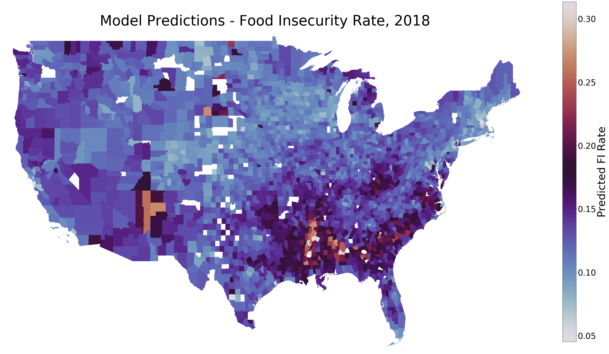


The maps above indicate that the model was able to capture the general trends of food insecurity, especially in places which are the most significantly impacted. The model did not perform as well at capturing the severity of FI rates in certain areas, such as Maine, the Pacific Northwest, and the Southeast. <br>
***Note:** Empty spaces indicate missing values due to a lack of data for one or more of the modeling features, for that county in the year 2018.*

# Conclusion
The final RFE Model 5 was able to explain about 75% of the variance in the data, based on a cross validation R2 score of 0.7486, and was off on predictions by an average of 2%, based on Test RMSE score of 0.0198. The most important features used in this model were shown to be `Unsheltered_rate_X_Percent_asian`, `Sheltered_rate_X_Percent_white`, `Sheltered_rate_X_Percent_Black`, `Houseless_rate_X_Percent_asian`, and `Unsheltered_rate_X_Percent_male`, based on model coefficients. 
<br>**This indicates that both houselessness and race play a critical role in determining the likelihood of food insecurity, but especially so when these features interact** (ie. someone who is both Black and houseless.)<br>  

The choropleth maps on 2018 FI Rate predictions indicate that the model was able to capture the general trend of food insecurity, particularly in places that are most impacted.


## Next Steps
There is a lot of room to improve the model's ability to explain even more variance in the data, potentially by adding more features such as household income, food assistance programs, age, disability, eviction data, and transportation access.<br><br>
**The next iteration of this project aims to accomplish the following:**
- include more features
- utilize statistical testing during EDA
- employ different types of regression models
- create an interactive map to visualize features and trends
- project FI rates on unlabeled data from 2020

## More Information

To explore the full project, please view the Jupyter Notebook files within the `notebooks/` folder, and the [presentation](presentation_slides.pdf) PDF document in the root of this repository.

For any additional questions, please contact **Khyatee Desai - khyatee.d@gmail.com**

## Repository Structure


```
├── README.md
├── src
│   ├── functions.py		<- Functions used in EDA notebook 
├── notebooks
│   ├── cleaning_pt1.ipynb		<- Preliminary data collection and cleaning notebook
│   ├── cleaning_pt2.ipynb		<- Final data cleaning process
│   ├── EDA.ipynb			<- Data anlysis & visualization notebook
│   ├── feature_engineering.ipynb
│   ├── modeling_process.ipynb  <- Feature selection and modeling
│   ├── predictons.ipynb  <- Model evaluation and predictions
├── datasets				<- Directory of all datasets used 
│   ├── businesses
|	├── cps
|	├── demographics
|	├── feeding_america
|	├── household
|	├── houseless
|	├── income 
|	├── rent_prices
|	├── unemployment
|	├── shapefile
├── images				<- All images produced from EDA
├── pickled				<- Cleaned datasets and final model
│   ├── fully_cleaned_data.pickle
│   ├── feature_engineered_data.pickle
│   ├── rfe_features.pickle
└   ├── random_forest_model.pickle
```


