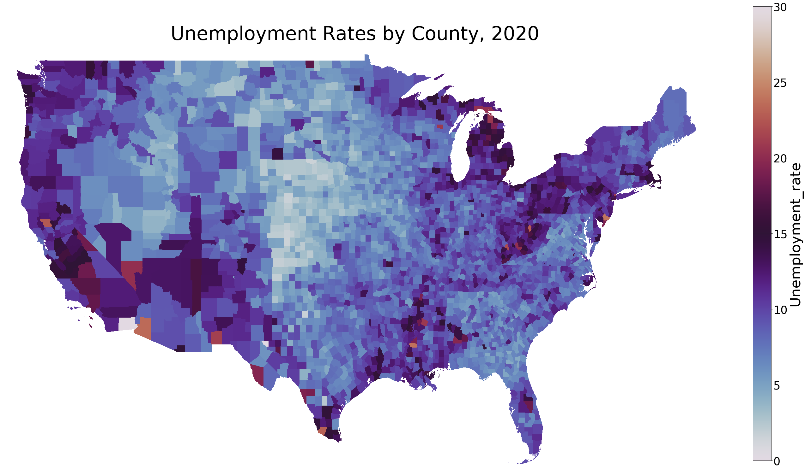

# Projecting Food Insecurity Rates in the US by County

### Flatiron School Data Science Capstone Project<br>By Khyatee Desai

# Overview
Food insecurity (FI) is defined as the inability to consistently and reliably obtain enough food, due to a lack of resources. Food insecurity rates are one of the primary metrics used in determining how resources get distributed to communities through government assistance programs such as the Supplemental Nutrition Assistance Program (SNAP,) through non-profits organizations such as Feeding America, and through mutual-aid projects. 
These organizations tend to prioritize resource allocation in the form of food, money, and financial relief to communities that demonstrate the greatest need in a *quantifiable* way. The goal of this project is to predict future food insecurity rates at the county level to aid in resource allocation and to better direct preventative measures to those areas *before* the issue gets worse.

# Business Problem

Food insecurity, is not a phenomena that can be easily predicted, or even measure in real-time for two reasons: first, it is dependent upon a number of interwoven factors that can grow and change in unpredictable ways. Second, FI rate is a measure that is often determined retroactively, based on how food-assistance programs end up being utilized, and how survey respondents end up reporting their past food-related needs.
Currently, food insecurity rates for the past year are determined through the Current Population Survey (CPS,) which is a nationally representative survey conducted by the Census Bureau for the Bureau of Labor Statistics. In December of each year, 50,000 households respond to this survey, answering questions related to income, food spending, and the use of government and community food assistance programs, all of which are factored together to produce an annual food insecurity rate estimation.
While this annual survey provides incredibly valuable insight into the past needs of people at the community level, it does not inherently have the predictive capability to determine which communities will face the greatest impacts from food insecurity in the future, *especially in the face of a worldwide pandemic that drastically impacts employment status, businesses, houselessness, and mobility.*
Therefore, the goal of this capstone project is to aid in a proactive solution to food insecurity, by using regression models to project future FI rates using closely linked indicators such as houselessness, food cost, race, and employment status.

# Data
The datasets used for the MVP model come from six different sources and are each broken down into yearly datasets spanning the years 2009-2020:

| DATASET        |   SOURCE   | DESCRIPTION                                                                                                                                                                                                                                                                                                                                                                                                                                                                                                                                                               |
|-------------|----------------------|---------------------------------------------------------------------------------------------------------------------------------------------------------------------------------------------------------------------------------------------------------------------------------------------------------------------------------------------------------------------------------------------------------------------------------------------------------------------------------------------------------------------------------------------------------------------------------|
| Food insecurity data    | Feeding America [Map the Meal Gap Study](https://www.feedingamerica.org/research/map-the-meal-gap/how-we-got-the-map-data)     | This dataset contains data on food insecurity rates in the US by county, from 2009-2018.                                                                                                                                                                                                                                                                                                                                                                                                                                                                                                                |
| Unemployment Data              | [Bureau of Labor Statistics](https://www.bls.gov/lau/#tables)        | This dataset contains yearly data on the Labor Force of each US county, for the years 2009-2019. The files include data on total workforce, and unemployment rates.                                                                                                                                                                                                                                                                                                                                                                                        |
| Demographic Data             | United States Census Bureau [County Population Estimates](https://www.census.gov/data/tables/time-series/demo/popest/2010s-counties-detail.html)        | This dataset contains columns on demographic information such as gender, race, and age, for each US county, for years 2010-2019.                                                                                                                                                                                                                                                                                                                                                                                                           |
| Houselessness Data   | US Dept. Housing & Urban Development (HUD) [Point in Time Estimates](https://www.hud.gov/2019-point-in-time-estimates-of-homelessness-in-US)      | This dataset contains data on houselessness rates in the US by Continuum of Care (CoC,) for the years 2009-2019.                                                                                                                                                                                                                                                                                                                                                                                                  |
| Rent Prices     | [Zillow Observed Rent Index](https://www.zillow.com/research/data/)      | This dataset contains _monthly_ data from Zillow.com on 1-bedroom rent prices _by zipcode_, for the years 2014-2020. The data is produced using the **Zillow Observed Rent Index** (ZORI,) which is a smoothed measure of the typical observed market rate rent across a given region.                                                                                                                                                                                                                                                                                                                                                                                      |
| Food Business Data           | US Census Bureau [County Business Patterns](https://www.census.gov/programs-surveys/cbp/data/datasets.html)      | This dataset contains data on all businesses in the US at the County level, for years 2009-2018. The dataset is used below to get Food Retail data, which includes grocery stores, wholesalers, and restaurants.                                                                                                                     |
                               
# Preprocessing
The datasets much undergo several important  pre-processing steps before EDA or modeling can occur:
-  import year for each dataset
- preliminary cleaning and isolating desired features
- map columns to coded values using data dictionaries
- derive GEOID's (also called FIPS codes) for each observation at the County level
- impute missing values 
- adjust datatypes
- reformat each dataframe in a standardized pattern
- concatenate all 6 dataframes into a main dataset

For a detailed walkthrough of this process, please view [cleaning_pt1.ipynb](notebooks/cleaning_pt1.ipynb) and [cleaning_pt2.ipynb](notebooks/cleaning_pt2.ipynb).
# Exploratory Data Analysis
This project focuses on projecting future FI rates, at the county level. This means that both **time** and **geography** are important components of understanding the data. The [EDA notebook](notebooks/EDA.ipynb) addresses 3 questions to help gain a better understanding of food insecurity, and how it relates to time and geography:<br>

## Question 1. How have factors such as unemployment, houselessness, and food insecurity rates changed over time?
The first EDA question explores how different features from the original dataset have changed over time. Because this project ultimately aims to project food insecurity rates for 2020, it is important to get an understanding of how features change over time, and whether they follow any discernable trends.<br>

Each feature group is scaled to the same magnitude, and visualized using lineplots or/and barcharts. The productions of these charts with multiple variables is accomplished using two functions: [`lineplot()`](src/functions.py) and [`barchart()`](src/functions.py), both of which can be found in the src folder of this repository.
### Food Insecurity, Houselessness, and Unemployment Rates, by Year
The charts below aim to visualize and compare the trends between these three scaled features over time:


The lineplots above indicate there is a visible correlation between FI rate (target variable,) unemployment, and houseless rates. This is important to keep in mind, moving into modeling and inspecting feature importance.

### Food Insecurity in Different Communities, by Year
The following lineplots aim to look at how average food insecurity rates differ across different racial communities over time:


The above lineplots indicate that average FI rates are highest in Black communities, followed by Indigenous and LatinX. While the general trend is downwards, some communities encounter anomalous movement, such as predominantly LatinX communities, which face an upward spike in FI Rates moving into 2018. It is important to note that these rates are not directly tied to racial groups, but rather counties with different predominant racial demographics.

### Average Unemployment Rates in Different Communities, by Year
The below cell performs the same process as above, this time looking at average Unemployment rates in different racial communities, by year.

The above linecharts indicate that predominantly Black and Indigenous communities face higher average rates of unemployment, followed by LatinX communities. The general trend of average unemployment rate is downwards over time.


## 2. Which geographic areas experience the highest rates of unemployment, houselessness, food insecurity rates, and racial segregation?
The purpose of exploring this question is to gain a better understanding of the geographic component of food insecurity and related features.

### Choropleth Maps
The following cells generate chroropleth maps, which are heatmaps that visualize a particular feature across a geographic area. The maps are generated using a function called [`choropleth()`](src/functions.py) which takes a dataframe, feature, year, color palette, and title, and generates a choropleth map.

### Unemployment Rate, by County, 2019 and 2020


Unemployment rates were at a record low in 2019 before the pandemic started, and shot up significantly in 2020, as can be seen by the maps above, which show a large increase in unemployment rates across the country, and especially on the coasts. 

### PoC Population Percentage by County, 2010 and 2018
These maps aim to visualize which areas of the country whose populations are predominantly people of color.


The above maps indicate that while the majority of US counties are predominantly white, there are significant areas, such as much of the southern states and portions of the Southwest that are predominantly communities of Color. There does not seem to be a significant change in this demographic spread between 2010 and 2018.

### Food Insecurity Rates by County, 2009 and 2018
The following maps visualize FI Rates by county in 2009 and 2018.


The maps above indicate lower average food insecurity rates over time in some areas, such as the Pacific Northwest, and significantly higher rates in Southern counties. This is important to note, given that national averages for FI rates have gone down over time, yet these maps indicate that in some communities, this problem has actually been exacerbated over time.<br>
More notably, when compared to the maps above, it should be noted that areas most effected by food insecurity very closely map to areas that are predominantly non-white.

## 3. Is there a relationship between food insecurity rate and other factors such as unemployment, houselessness, food availability, and race?
The purpose of this final EDA question is to determine how the other features in the dataset, such as Food Retail presence and houselessness, relate to food insecurity rates. These observations will be important to keep in mind moving into the modeling process and looking at coefficients/feature importances.

### FI Distribution, by Rent Prices
The below histograms show the distribution of FI rates in areas with 1-br apartment rent prices above $2000, vs areas with rent prices below $1000.

The above histograms indicate a visually significant difference between the two. Areas with lower rent prices have generally higher FI Rates, while areas with higher rent prices have lower FI Rates. This makes sense, given that "wealthier" areas likely less from food insecurity.

### FI Rate Distributions, by Unemployment Rate
The following histograms plot FI rate distribution, by areas with unemployment rates above %15, vs areas with unemployment rates below %5.

The above historams show a visually significant difference in FI rates between areas based on unemployment rates. Areas with high unemployment rates have higher average FI Rates, while areas with low unemployment rates have lower average FI Rates. This is pretty intuitive, given that being unemployed is a likely cause of being unable to afford food.

### FI Distributions, by Houseless Rates
The below histograms plot food insecurity distributions of areas with a houseless rate above %1, and areas with a houseless rate below %0.01.

The above histograms indicate a visually significant difference between the two distributions. Areas with higher houselessness rates have a higher average FI Rate than areas with low houselessness. This makes sense, given that being houseless possibly indicates a lack of money, which lacks to an inability to buy enough food.

### FI Rate Distribution, by Race
The following histograms plot food insecurity rate distributions for areas of predominantly different races.

The above histograms indicate a visually significant different in FI rates for different racial communities. Areas that are predominantly Black are shown to have a much higher average FI rate than predominantly white or LatinX communities. This is important to keep in mind, when considering feature importance and factors that are significant indicators for food insecurity.

## EDA Summary
The purpose of this exploratory data analysis was to explore the above questions through the lense of **time** and **geography**.

From the analysis, we see close relationships between FI Rates, unemployment rates, houseless rates, and race, both in terms of which areas are geographically impacted most, and how these different features have changed over time. Communities of color, particularly Black communities, as well as communities with high unemployment and houselessness are shown through this analysis to have the highest FI rates. In addition, while many features such as FI rate, unemployment, and houselessness have decreased over time *on average*, the visualizations above highlight how these factors have actually been exacerbated in certain geographic areas over time.<br>

The findings of this data exploration are meaningful when determining which communities and geographic areas are most at-risk for high food insecurity rates, and should be used both in terms of allocating resources to these communities, as well as taking proactive measures to address the root cause of these issues that disproportionately affect some more than others.

## Modeling Process

## Model Evaluation


## Conclusion & Next Steps


## For More Information

Please review the full project in [my EDA notebook](), [Modeling notebook]() and [presentation]().

For any additional questions, please contact **Khyatee Desai - khyatee.d@gmail.com**

## Repository Structure


```
├── README.md
├── notebooks
│   ├── cleaning_pt1.ipynb		<- Preliminary data collection and cleaning notebook
│   ├── cleaning_pt2.ipynb		<- Final data cleaning process
│   ├── EDA.ipynb				<- Data anlysis & visualization notebook
│   ├── feature_engineering.ipynb
│   ├── modeling.ipynb			<- Feature selection, modeling, and evaluation
├── datasets			<- Directory of all datasets used 
│   ├── businesses
|	├── demographics
|	├── feeding_america
|	├── household
|	├── houseless
|	├── income 
|	├── rent_prices
|	├── unemployment
|	├── shapefile
├── images				<- All images produced from EDA
├── pickled				<- Cleaned datasets and final model
│   ├── partially_cleaned_data.pickle
│   ├── fully_cleaned_data.pickle
└   ├── feature_engineered_data.pickle
 modeling_process.ipynb
```


